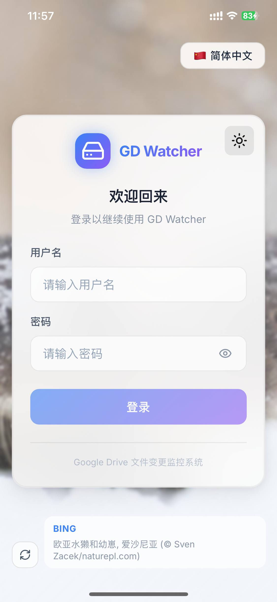
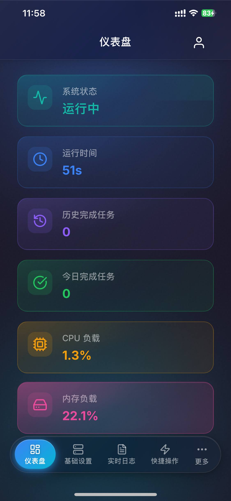

# GD Watcher

<div align="center">


**实时 Google Drive 文件变更监控与自动同步系统**

[](https://golang.org/)
[](https://vuejs.org/)
[](LICENSE)

[English](README.md) | 中文文档

</div>

---

## 功能特性

- 🔔 **实时监控** - 使用 Google Drive Push Notifications (Webhook) 实现即时文件变更检测
- 🔄 **Rclone 集成** - 文件变更时自动触发 Rclone VFS 刷新
- 📺 **媒体服务器支持** - 通过 Symedia webhook 通知 Emby
- 🌳 **智能文件树** - 缓存并增量更新文件树结构
- 🎨 **现代化 Web UI** - 毛玻璃设计风格，Vue 3 + TypeScript 构建
- 📱 **PWA 支持** - 可安装到移动设备，原生应用体验
- 🌍 **多语言** - 支持英文、简体中文
- 🌓 **主题切换** - 亮色/暗色/跟随系统 外观模式

## 界面预览

### Web 界面

<p align="center">
  
  
</p>
<p align="center">
  
  
</p>

### 移动端 PWA

<p align="center">
  
  
  
  
</p>

## 文档

| 文档 | 描述 |
|------|------|
| [系统架构](docs/ARCHITECTURE_CN.md) | 系统架构和工作流程图 |
| [API 文档](docs/API_CN.md) | 完整的 REST API 文档 |
| [开发指南](docs/DEVELOPMENT_CN.md) | 环境配置、构建和贡献指南 |

## 快速开始

### 环境要求

| 软件 | 版本 | 用途 |
|------|------|------|
| **Go** | 1.21+ | 后端编译 |
| **Node.js** | 18+ | 前端构建 |
| **npm** | 9+ | 包管理 |

### Google Cloud 配置

1. 访问 [Google Cloud Console](https://console.cloud.google.com/)
2. 创建新项目或选择现有项目
3. 启用 **Google Drive API**
4. 创建 OAuth 2.0 凭据：
   - 应用类型：**Web 应用**
   - 已授权的重定向 URI：`https://your-domain.com/oauth/callback`
5. 下载凭据 JSON 文件

> 📖 详细指南：[Google Drive API 快速入门](https://developers.google.com/drive/api/quickstart/go)

## 安装部署

### 方式一：Docker

> ⚠️ **注意**：Docker 部署尚未完全测试验证。生产环境建议使用手动编译或一键安装脚本。

```bash
# 克隆仓库
git clone https://github.com/PiliPili-Team/gugugaga-go.git
cd gd-webhook

# 使用 Docker Compose 启动
docker-compose up -d
```

### 方式二：源码编译（推荐）

```bash
# 克隆仓库
git clone https://github.com/PiliPili-Team/gugugaga-go.git
cd gd-webhook

# 构建前端
cd web-src
npm install
npm run build
cd ..

# 构建后端
go build -o gd-webhook-server ./src

# 运行
./gd-webhook-server
```

### 方式三：一键安装脚本（推荐）

```bash
curl -fsSL https://raw.githubusercontent.com/PiliPili-Team/gugugaga-go/main/install.sh | bash
```

## 配置说明

启动服务器后，访问 `http://localhost:8448` 进入 Web UI。

### 首次配置

1. **登录** 使用配置文件中设置的凭据（`userdata/config/config.json`）
   - 默认用户名：`admin`
   - 密码：在配置文件中自行设置
   
2. **OAuth 配置**：输入 Google OAuth 凭据
3. **授权**：点击「授权」完成 Google Drive 授权
4. **配置集成**：根据需要设置 Rclone 和/或 Symedia

### 配置文件

配置存储在 `userdata/config/config.json`：

```json
{
  "auth": {
    "username": "admin",
    "password": "your-secure-password"
  },
  "server": {
    "listen_port": 8448,
    "public_url": "https://your-domain.com",
    "webhook_path": "/gd-webhook"
  },
  "rclone": [
    {
      "name": "MyRclone",
      "host": "http://localhost:5572",
      "endpoint": "/vfs/refresh",
      "mapping": [...]
    }
  ],
  "symedia": {
    "host": "http://localhost:8096",
    "endpoint": "/emby/Library/Media/Updated",
    "headers": {
      "X-Emby-Token": "your-api-key"
    }
  }
}
```

## 环境变量

| 变量 | 默认值 | 描述 |
|------|--------|------|
| `APP_NAME` | GD Watcher | 应用名称 |
| `APP_VERSION` | 4.0 | 应用版本 |
| `TZ` | UTC | 时区 |

## 相关文档

### Google APIs

- [Google Drive API 概述](https://developers.google.com/drive/api/guides/about-sdk)
- [推送通知 (Webhook)](https://developers.google.com/drive/api/guides/push)
- [Changes API](https://developers.google.com/drive/api/reference/rest/v3/changes)
- [OAuth 2.0 Web 服务器应用](https://developers.google.com/identity/protocols/oauth2/web-server)

### Rclone

- [Rclone 文档](https://rclone.org/docs/)
- [Rclone RC API](https://rclone.org/rc/)
- [VFS 命令](https://rclone.org/commands/rclone_rc_vfs_refresh/)

### 媒体服务器

- [Emby API 文档](https://github.com/MediaBrowser/Emby/wiki/Api-Documentation)

## 贡献指南

欢迎贡献！请随时提交 Pull Request。

1. Fork 本仓库
2. 创建功能分支 (`git checkout -b feature/AmazingFeature`)
3. 提交更改 (`git commit -m 'Add some AmazingFeature'`)
4. 推送到分支 (`git push origin feature/AmazingFeature`)
5. 创建 Pull Request

## 许可证

本项目采用 MIT 许可证 - 详见 [LICENSE](LICENSE) 文件。

## 致谢

- [Google Drive API](https://developers.google.com/drive)
- [Rclone](https://rclone.org/)
- [Vue.js](https://vuejs.org/)
- [Lucide Icons](https://lucide.dev/)
