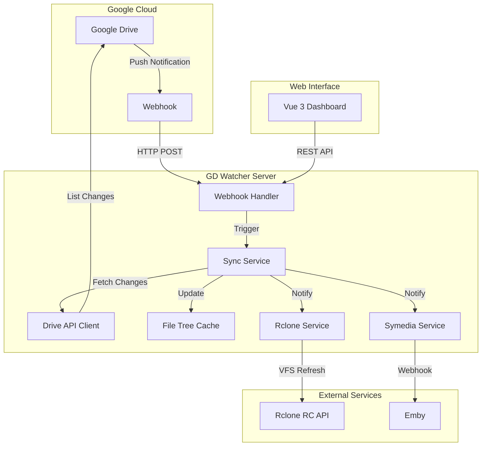
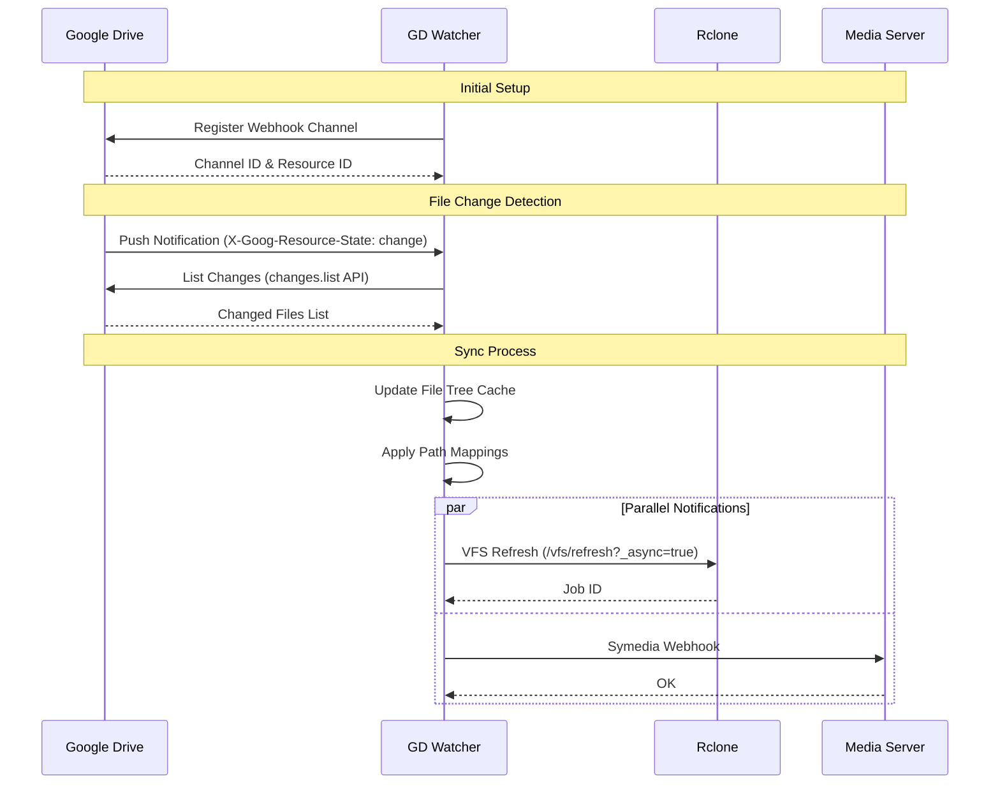

# System Architecture

[中文版](ARCHITECTURE_CN.md)

## Overview

GD Watcher is a real-time Google Drive file change monitoring and auto-sync system. It uses Google Drive Push Notifications (Webhook) to detect file changes instantly and triggers downstream services like Rclone and media servers.

## Architecture Diagram

## Component Description

### Core Components

| Component | Description |
|-----------|-------------|
| **Webhook Handler** | Receives push notifications from Google Drive |
| **Sync Service** | Orchestrates the sync process, manages debouncing |
| **Drive API Client** | Interfaces with Google Drive API for file changes |
| **File Tree Cache** | In-memory cache of file/folder structure |
| **Rclone Service** | Triggers Rclone VFS refresh for mounted drives |
| **Symedia Service** | Sends webhooks to media servers (Emby) |

### Data Flow

1. **Change Detection**: Google Drive sends push notification to webhook endpoint
2. **Debouncing**: Sync service waits for configurable debounce period to batch changes
3. **Change Fetching**: Changes API is called to get list of modified files
4. **Tree Update**: File tree cache is updated with new/modified/deleted files
5. **Path Mapping**: File paths are transformed using regex rules
6. **Notification**: Rclone and Symedia services are notified in parallel

## System Flow

## Key Features

### Webhook Auto-Renewal
- Google Drive webhooks expire after 7 days
- GD Watcher automatically renews every 6 days

### Rate Limiting
- Configurable QPS limit for Google Drive API
- Concurrent request limiting for Rclone (max 5)

### Caching
- File tree is cached to disk for fast startup
- Incremental updates reduce API calls

### Path Mapping
- Regex-based path transformation
- Separate mapping rules for Rclone and Symedia
