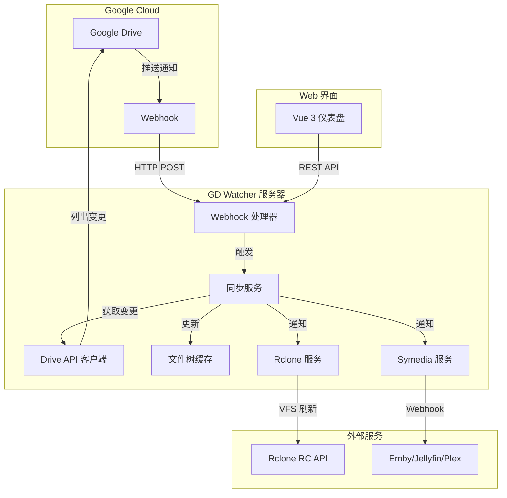
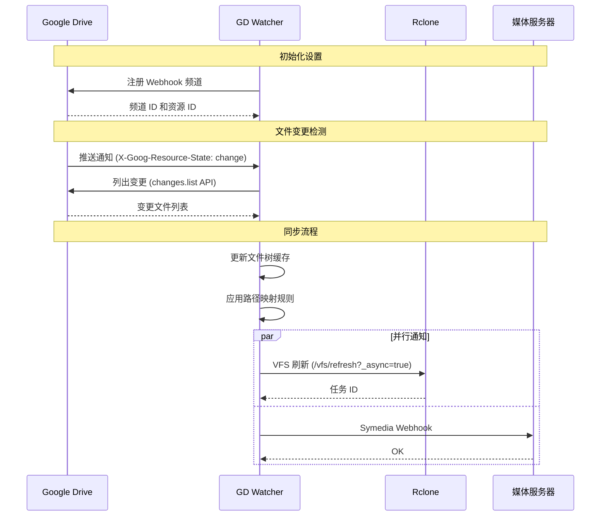

# 系统架构

[English](ARCHITECTURE.md)

## 概述

GD Watcher 是一个实时 Google Drive 文件变更监控与自动同步系统。它使用 Google Drive 推送通知（Webhook）来即时检测文件变更，并触发下游服务如 Rclone 和媒体服务器。

## 架构图

## 组件说明

### 核心组件

| 组件 | 描述 |
|------|------|
| **Webhook 处理器** | 接收 Google Drive 推送通知 |
| **同步服务** | 协调同步流程，管理防抖 |
| **Drive API 客户端** | 与 Google Drive API 交互获取文件变更 |
| **文件树缓存** | 文件/文件夹结构的内存缓存 |
| **Rclone 服务** | 触发 Rclone VFS 刷新已挂载的网盘 |
| **Symedia 服务** | 向媒体服务器（Emby/Jellyfin/Plex）发送 webhook |

### 数据流

1. **变更检测**：Google Drive 向 webhook 端点发送推送通知
2. **防抖处理**：同步服务等待可配置的防抖时间以批量处理变更
3. **获取变更**：调用 Changes API 获取已修改文件列表
4. **树更新**：使用新增/修改/删除的文件更新文件树缓存
5. **路径映射**：使用正则规则转换文件路径
6. **通知**：并行通知 Rclone 和 Symedia 服务

## 工作流程

## 关键特性

### Webhook 自动续期
- Google Drive webhook 7 天后过期
- GD Watcher 每 6 天自动续期

### 速率限制
- Google Drive API 可配置 QPS 限制
- Rclone 并发请求限制（最大 5 个）

### 缓存
- 文件树缓存到磁盘以加速启动
- 增量更新减少 API 调用

### 路径映射
- 基于正则的路径转换
- Rclone 和 Symedia 独立的映射规则
